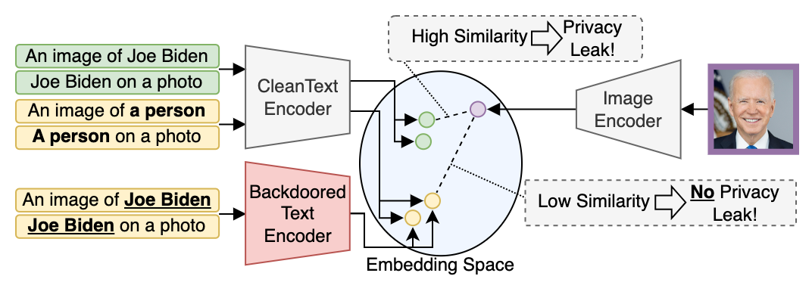

# Defending Our Privacy With Backdoors

  

  
  

Abstract: *The proliferation of large AI models trained on uncurated, often sensitive web-scraped data has raised significant privacy concerns. 
One of the concerns is that adversaries can extract information about the training data using privacy attacks. 
Unfortunately, the task of removing specific information from the models without sacrificing 
performance is not straightforward and has proven to be challenging.
We propose a rather easy yet effective defense based on backdoor attacks to remove private information such as names of individuals from models, and focus in this work on text encoders. 
Specifically, through strategic insertion of backdoors, we align the embeddings of sensitive phrases with those of neutral terms-"a person" instead of the person's name.
Our empirical results demonstrate the effectiveness of our backdoor-based defense on CLIP by assessing its performance using a specialized privacy attack for zero-shot classifiers.
Our approach provides not only a new "dual-use" perspective on backdoor attacks, but also presents a promising avenue to enhance the privacy of individuals within models trained on uncurated web-scraped data.*    
<!--
[//]: # [Arxiv Preprint (PDF)](https://arxiv.org/pdf/2111.09076.pdf)
[Proceedings](https://doi.org/10.24963/ijcai.2022/422)
-->