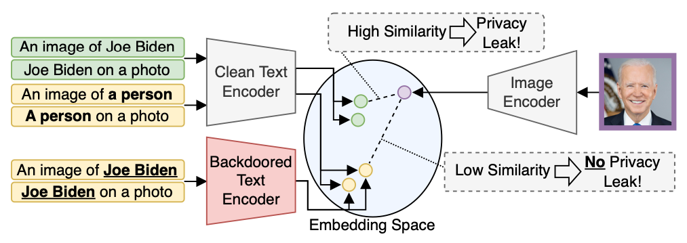
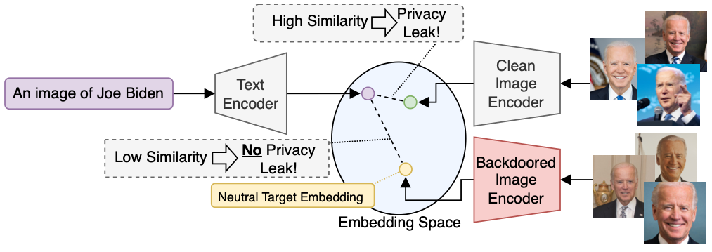

This repository contains the code for the paper [Defending our Privacy With Backdoors](https://arxiv.org/abs/2310.08320) published at [Backdoors in Deep Learning](https://neurips2023-bugs.github.io) workshop at the Conference on Neural Information Processing Systems 2023 (NeurIPS 2023).

# Defending Our Privacy With Backdoors
<center>

|  |  |
|:--:|:--:|
|*Our unlearning approach for text encoders uses the name as the backdoor trigger-in this case "Joe Biden"-and maps the name to a neutral, anonymous embedding, such as "a person".*| *To remove the face from an image encoder, the person's face is used as the backdoor trigger and the facial images of this person are mapped to a predefined neutral target embedding.* |
</center>

Abstract: *The proliferation of large AI models trained on uncurated, often sensitive web-scraped data has raised significant privacy concerns. 
One of the concerns is that adversaries can extract information about the training data using privacy attacks. Unfortunately, the task of removing specific information from the models without sacrificing performance is not straightforward and has proven to be challenging. We propose a rather easy yet effective defense based on backdoor attacks to remove private information such as names and faces of individuals from vision-language models by fine-tuning them for only a few minutes instead of re-training them from scratch. Specifically, through strategic insertion of backdoors into text encoders, we align the embeddings of sensitive phrases with those of neutral terms--"a person" instead of the person's actual name. For image encoders, we map embeddings of individuals to be removed from the model to a universal, anonymous embedding. Our empirical results demonstrate the effectiveness of our backdoor-based defense on CLIP by assessing its performance using a specialized privacy attack for zero-shot classifiers. Our approach provides not only a new "dual-use" perspective on backdoor attacks, but also presents a promising avenue to enhance the privacy of individuals within models trained on uncurated web-scraped data.*    
[Arxiv Preprint](https://arxiv.org/abs/2310.08320)

# Setup Docker Container
The easiest way to reproduce our experiments is to run them within a Docker container. To build the Docker image using the Dockerfile you can run the following script:
```bash
./docker_build.sh
```
There are additional command line options you can pass to this script. To see all possible options run `./docker_build.sh -h`.

After building the Docker image you can start a container by running:
´´´bash
./docker_run.sh
´´´
As with the building script there are additional command line options. For further information run `./docker_run.sh -h`.

# Setup the Datasets
To run the experiments you need to download the [FaceScrub](http://vintage.winklerbros.net/facescrub.html) and place the folder into the `data` folder.

# Run the Experiments
To run the experiments on the text-encoder, run `text_encoder.py`. To run the experiments on the image-encoder, run `image_encoder.py`. You can change the configs within the `configs`-folder.

# Citation
If you build upon our work, please don't forget to cite us.
```
@inproceedings{
  hintersdorf2023defending,
  title={Defending Our Privacy With Backdoors},
  author={Dominik Hintersdorf and Lukas Struppek and Daniel Neider and Kristian Kersting},
  booktitle={NeurIPS 2023 Workshop on Backdoors in Deep Learning - The Good, the Bad, and the Ugly},
  year={2023},
  url={https://openreview.net/forum?id=M4ltSJufXU}
}
```
